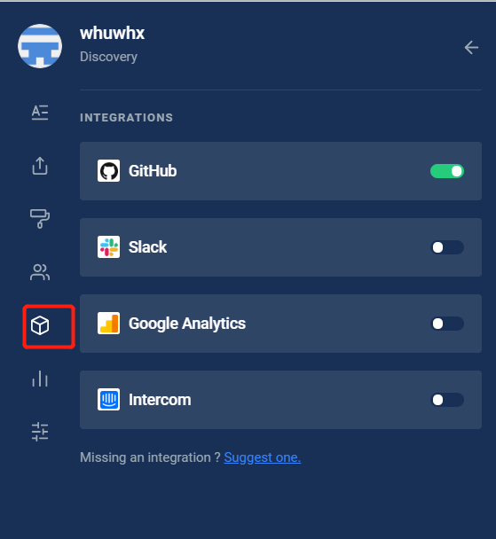
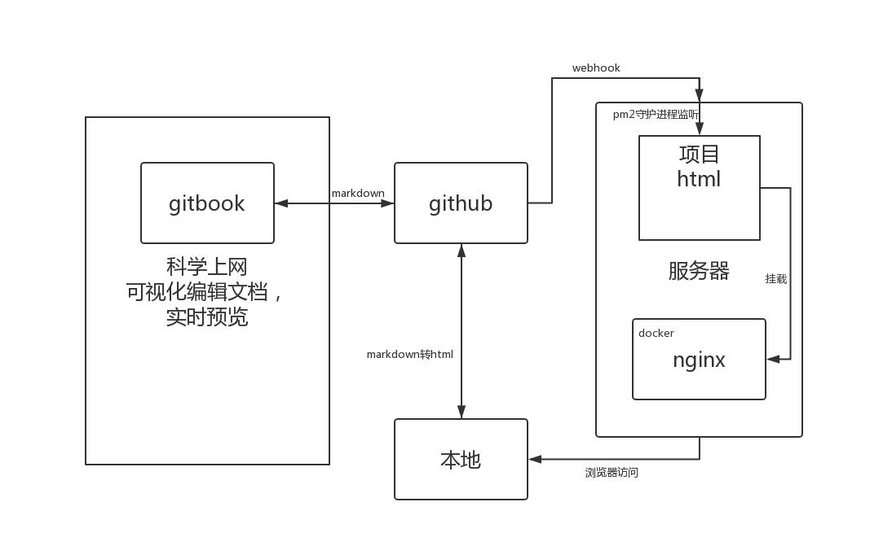

# CI/CD

## 简述

gitbook是依赖于nodejs的工具包，可以将markdown文档处理为html网页进行发布。gitbook处理后的文档，笔记效果很好，条理清楚，页面美观。但是markdown文档撰写不方便，没有交互式的体验。后来去了gitbook的官网，在这上面快速方便的撰写，效率很高，并且可以同步到github上面去。但是由于gitbook需要科学上网才能访问，写的文档需要同步部署到国内需要CI/CD的支持。

## 一、gitbook注册与使用并绑定github账号（科学上网）

官网[https://app.gitbook.com](https://app.gitbook.com)，注册后绑定github账号即可



## 二、github配置


webhook是github对外通信的插件，此项目绑定两个webhook，一个是gitbook的官网，一个是你所需要通知更改的服务器。上面的那个在第一步后会自动生成，下面的需要自己去加，并且需要secret类似密钥。只有携带secret的访问才会触发服务器上面的进程。


## 三、服务器配置

参考资料[https://segmentfault.com/a/1190000016071010](https://segmentfault.com/a/1190000016071010)

当github上面的代码触发push动作后，调用webhook向外发通知。因此，服务器要实时的监听github给它的信息，需要使用github-webhook-handler进行实时的监听。同时也需要pm2进行守护进程。这两个工具都需要nodejs的支持，因此需要提前安装node环境。

安装webhook的监听

```
npm i -g github-webhook-handler
```

新建一个webhook.js的文件

```text
var http = require('http')
var createHandler = require('github-webhook-handler')
var handler = createHandler({ path: '/', secret: '****' })
// 上面的 secret 保持和 GitHub 后台设置的一致
function run_cmd(cmd, args, callback) {
  var spawn = require('child_process').spawn;
  var child = spawn(cmd, args);
  var resp = "";
  child.stdout.on('data', function(buffer) { resp += buffer.toString(); });
  child.stdout.on('end', function() { callback (resp) });
}
http.createServer(function (req, res) {
  handler(req, res, function (err) {
    res.statusCode = 404
    res.end('no such location')
  })
}).listen(7777)
handler.on('error', function (err) {
  console.error('Error:', err.message)
})
handler.on('push', function (event) {
  console.log('Received a push event for %s to %s',
    event.payload.repository.name,
    event.payload.ref);
    run_cmd('sh', ['./deploy.sh',event.payload.repository.name], function(text){ console.log(text) });
})
```

上面的文件是监听的处理文件，是一个静态的js脚本文件，是对github的webhook的处理，如果响应成功，会执行同一个目录下的shell脚本deploy.sh。因此需要在同一个目录下新建一个deploy.sh文件

```text
#!/bin/bash
# 网站的根目录
WEB_PATH='/home/wwwroot/domain.com'
 
echo "start deployment"
cd $WEB_PATH
echo "fetching from remote..."
# 为了避免冲突，强制更新本地文件
git fetch --all
git reset --hard origin/master
echo "done"
```

上述的WEB\_PATH是git项目的路径，

注意：shell脚本的格式问题，先执行sed -i 's/\r$//' deploy.sh进行格式化。

注意：要初始化拉取一下代码，绑定git。


使用pm2守护进程

安装pm2：

```text
npm i pm2 -g
```

运行webhook.js

```text
pm2 start webhook.js
```

## 四、网页发布

前段时间，github支持CI/CD，可以通过在.github/workflow文件目录，下编写yaml文件，执行cicd。如下

```text
name: Node CI

on: [push]

jobs:
  build:

    runs-on: ubuntu-latest

    strategy:
      matrix:
       # node-version: [8.x, 10.x, 12.x]
        node-version: [12.x]

    steps:
    - uses: actions/checkout@v1
    - name: Use Node.js ${{ matrix.node-version }}
      uses: actions/setup-node@v1
      with:
        node-version: ${{ matrix.node-version }}
    - name: npm install, build, and test
      run: |
        npm install
        npm install -g gitbook-cli
        gitbook init
        gitbook build .
      env:
        CI: true

```

上述文件可以将markdown文档自动构建为网页，但是将gitbook build的结果进行持续发布时，未能找到相关的文档。卒。。。

因此，只能在本地安装gitbook，通过gitbook build命令，在文件目录下生成html文件，上传到项目内。


最后，在服务器，使用docker启动一个nginx，将WEB\_PATH里面的项目下的\_book目录挂载到nginx中，一条命令解决。

```text
docker run -p 4000:80 --name gitbook -d nginx -v /whx/note/_book:/usr/share/nginx/html
```

## 五、流程图与总结



不需要关注markdown文件的语法与html的情况，使用gitbook官网的方式写文档，最后托管在github上面，使用git分布式的理念，便于网站的迁移。

可惜的是未用到github上面的CI/CD，在本地进行手动的集成。

